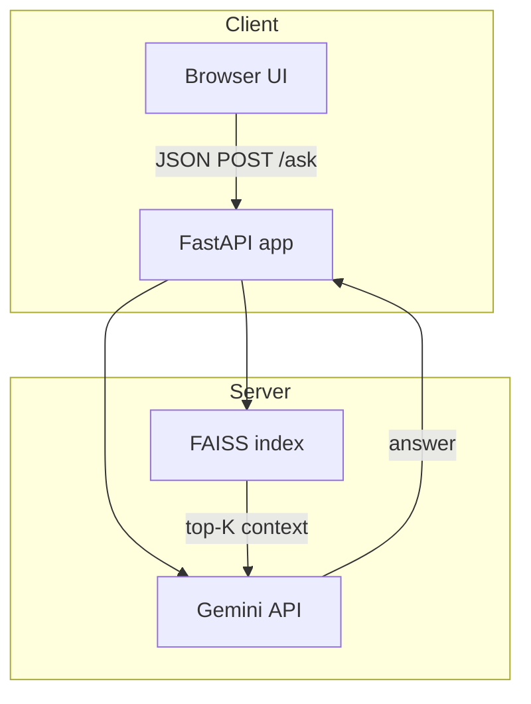

# FedAutoQA


FedAutoQA is a **retrieval‑augmented QA micro‑service** that answers questions about HCUP (Healthcare Cost and Utilization Project) documentation.  
It combines semantic search (Sentence‑Transformers + FAISS) with Google’s **Gemini 2** models, wrapped in a lightweight FastAPI backend and an in‑browser HTML interface.

---

## ✨ Key Features

- **One-click local UI** – open `http://localhost:8000` and ask questions right away  
- **RAG pipeline** – dense embedding search retrieves top‑K FAQ chunks and feeds them to Gemini with a strict system prompt  
- **Stateless API** – single `/ask` POST endpoint; easy to integrate into any frontend  
- **Docker-ready** – run the full stack with `docker compose up`  
- **Configurable LLM** – can switch between `gemini‑2.0‑flash` and `gemini‑2.0‑pro` with a single setting  
- **Test corpus included** – ships with ~2 MB of HCUP FAQ data split into 300+ chunks for instant experimentation  

---

## 🏗️ Architecture



---

## 🚀 Quick Start

```bash
# 1. Clone
git clone https://github.com/KenSu223/FedAutoQA.git
cd FedAutoQA

# 2. Install deps (Python 3.11+)
python -m venv .venv && source .venv/bin/activate
pip install -r requirements.txt

# 3. Configure API Key
#3.a option A: Set your Gemini key
export GOOGLE_API_KEY="<YOUR_TOKEN>"           # or GEMINI_API_KEY

# 3.b Option B: You could also create your own .env file in the project root (same level as api.py). The key will be accessible until you close the terminal (or unset it), and it won’t persist across terminal sessions 
cp .env.example .env
# Open .env and replace the placeholder with your actual API key, then the application will automatically load this key using python-dotenv.
GOOGLE_API_KEY=your-google-api-key-here

# 4. Fire it up
python api.py

# 5. Open the UI
open http://localhost:8000/docs
```

### Using Docker

```bash
docker compose up --build
```

---

## ⚙️ Configuration

| Variable            | Purpose                                | Default               |
|---------------------|----------------------------------------|-----------------------|
| `GOOGLE_API_KEY`    | Your Gemini API key                    | _required_            |
| `SIM_THRESHOLD`     | Min cosine similarity for retrieved chunk | `0.01` (adjustable)                 |
| `TOP_K`             | Number of context chunks to send to LLM | `5`                   |
| `MODEL_NAME`        | Gemini model (`gemini-2.0-flash`/`-pro`) | `gemini-2.0-flash`    |

Update values in **`api.py`** or via environment variables.

---

## 📑 API Reference

| Method | Route | Body (JSON)           | Response (JSON)                                               |
|--------|-------|-----------------------|----------------------------------------------------------------|
| `POST` | `/ask`| `{ "query": "..." }`  | `{ "answer": "...", "similarities": [...], "retrieved_ids": [...] }` |

---

## 🗂️ Project Layout

```
├─ api.py              # FastAPI server + FAISS search
├─ build_index.py      # Build FAISS index from chunks
├─ environment.yml     # Conda environment definition
├─ faiss_index.bin     # Saved FAISS index
├─ faq_pairs.jsonl     # Raw FAQ data
├─ llm.py              # Gemini wrapper
├─ metadata.pkl        # Retrieved FAISS metadata
├─ QA.txt              # Misc questions and prompts
├─ requirements.txt    # Python dependencies
├─ scraper.py          # HTML to chunk pipeline
├─ system_prompt.txt   # System prompt used for Gemini
└─ README.md
```

---

## 🙌 Contributing

1. Fork the repo & create a branch: `git checkout -b feat/my-feature`  
2. Commit changes with conventional commits  
3. Push and open a PR – feedback is welcome!

---

## 📄 License

This project is released under the [MIT License](LICENSE).  
Created as a prototype using only public data and tools.  
Not officially sponsored or commissioned by any organization.

---

### ✉️ Contact

Maintainer – **Shijia Huang** · [GitHub](https://github.com/Shijia-Huang)
