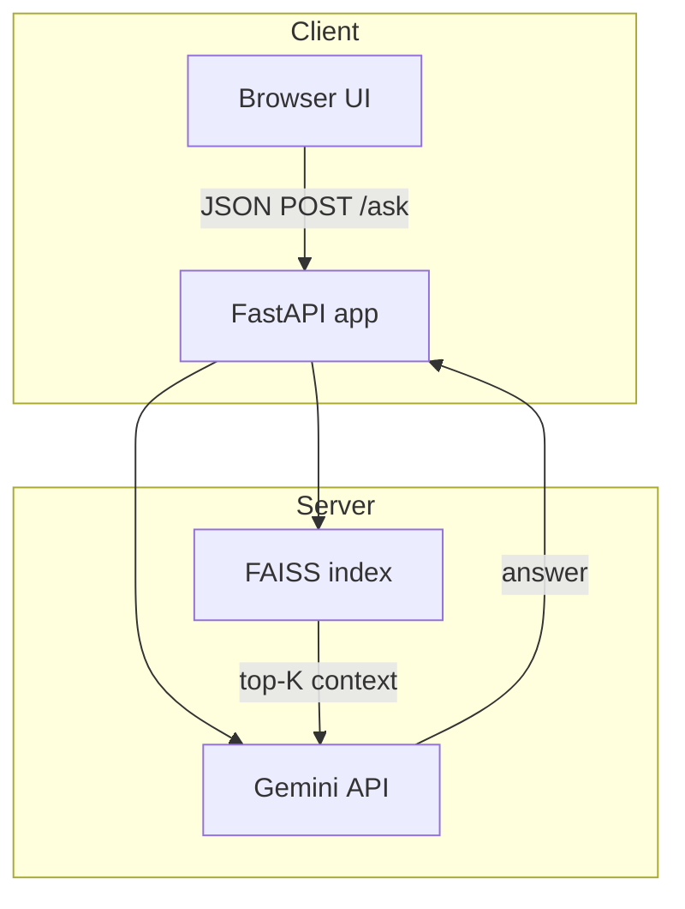

# FedAutoQA


FedAutoQA is a **retrieval‑augmented QA micro‑service** that answers questions about HCUP (Healthcare Cost and Utilization Project) documentation.  
It combines semantic search (Sentence‑Transformers + FAISS) with Google’s **Gemini 2** models, wrapped in a lightweight FastAPI backend and an in‑browser HTML interface.

---

## ✨ Key Features

- **One‑click local UI** – open `http://localhost:8000` and ask questions right away  
- **RAG pipeline** – dense embedding search retrieves top‑K FAQ chunks which are fed to Gemini with a strict system prompt  
- **Stateless API** – single `/ask` POST endpoint; easy to drop behind any frontend  
- **Docker‑ready** – run the whole stack with one `docker compose up`  
- **Configurable LLM** – flip between `gemini‑2.0‑flash` for speed or `gemini‑2.0‑pro` for quality  
- **Test corpus** – ships with ~2 MB of HCUP FAQ text split into 300 chunks for instant experimentation  

---

## 🏗️ Architecture



---

## 🚀 Quick Start

```bash
# 1. Clone
git clone https://github.com/KenSu223/FedAutoQA.git
cd FedAutoQA

# 2. Install deps (Python 3.11+)
python -m venv .venv && source .venv/bin/activate
pip install -r requirements.txt

# 3. Set your Gemini key
export GOOGLE_API_KEY="<YOUR_TOKEN>"           # or GEMINI_API_KEY

# 4. Fire it up
uvicorn api:app --reload

# 5. Open the UI
open http://localhost:8000/docs
```

### Using Docker

```bash
docker compose up --build
```

---

## ⚙️ Configuration

| Variable            | Purpose                                | Default               |
|---------------------|----------------------------------------|-----------------------|
| `GOOGLE_API_KEY`    | Your Gemini API key                    | _required_            |
| `SIM_THRESHOLD`     | Min cosine similarity for retrieved chunk | `0.7`                 |
| `TOP_K`             | Number of context chunks to send to LLM | `5`                   |
| `MODEL_NAME`        | Gemini model (`gemini-2.0-flash`/`-pro`) | `gemini-2.0-flash`    |

Update values in **`api.py`** or via environment variables.

---

## 📑 API Reference

| Method | Route | Body (JSON)           | Response (JSON)                |
|--------|-------|-----------------------|--------------------------------|
| `POST` | `/ask`| `{ "query": "..." }`  | `{ "answer": "...", "context": [...] }` |

---

## 🗂️ Project Layout

```
├─ api.py            # FastAPI server + FAISS search
├─ llm.py            # Gemini wrapper
├─ data/faq_chunks.pkl
├─ models/           # Sentence‑Transformers embeddings
├─ templates/        # (unused) Jinja templates
└─ README.md
```

---

## 🙌 Contributing

1. Fork the repo & create a branch: `git checkout -b feat/my-feature`  
2. Commit changes with conventional commits  
3. Push and open a PR – feedback is welcome!

---

## 📄 License

This project is released under the [MIT License](LICENSE).

---

### ✉️ Contact

Maintainer – **Ken Su** · [GitHub @KenSu223](https://github.com/KenSu223)